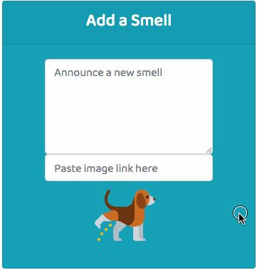
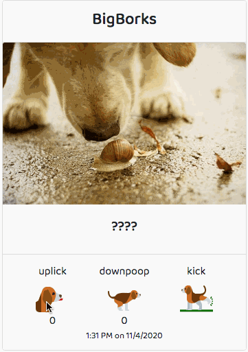
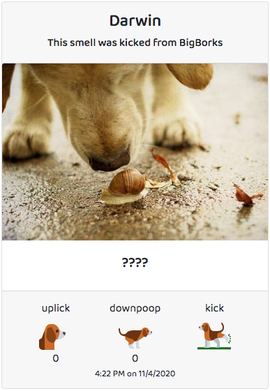

# Sniffr

Sniffr is a web application designed to allow pups to share the latest news. 

## Features
### The Smell Feed
The Smell Feed shows all the latest smells that have been posted by any member of Sniffr.

Members can post their smells (text and/or images) in the first card of the feed.

### Reacting to Smells
Below the content of each smell are three icons: uplick, downpoop, and kick.
  
The uplick and downpoop buttons signify positive and negative reactions respectively.  
The kick button creates a new smell with the exact same content. The newly created smell will specify that it was kicked and from whom.  

### My Smells
The My Smells page uses the same format as the Smell Feed, but shows only the Smells that the member has posted.

## TODO:
- Update User schema to include the field 'displayName' and store usernames in lowercase (to avoid duplicate usernames - e.g. pupper & Pupper)
- Add requirements for password strength
- Hash & salt passwords
- Add 'See More' button at bottom of feed to retrieve older smells
- Create a Profile page for users to update their password, delete their account, etc.
- Add support for gifs
- Add support for videos
- Make usernames clickable so that users can see all the smells posted by any member